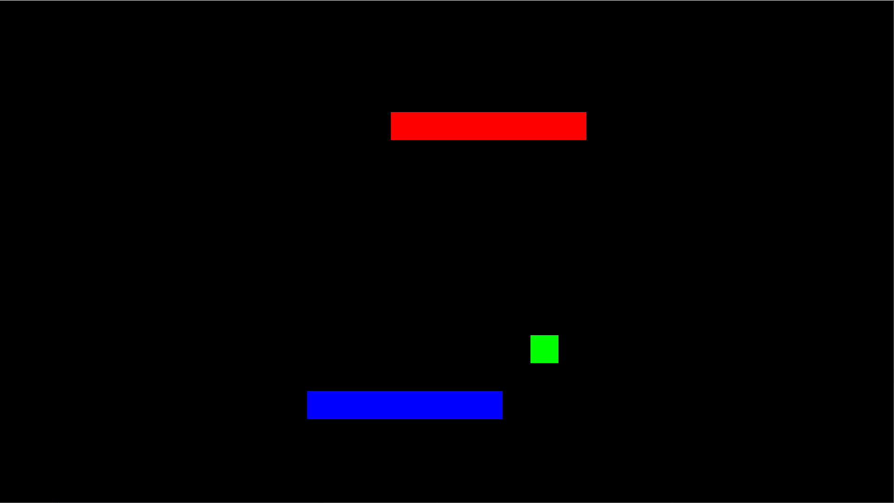

# snake2d

This is a basic snake clone created with libgdx using Java. The only twist is that two snakes are present instead of one. 
The first snake is controlled using WASD, the second snake is controlled using arrow keys.

It can either be played with one to two players.

## Quick Setup

After cloning this repository change to its directory. Open the terminal/command line interface from that directory. 
Since this project uses libgdx it uses Gradle. 

Run "gradlew build" to build this project.

Run "gradlew dist" to build its self-executable jar. The jar can be found in ./snake2d/desktop/build/libs

## License 

This project is licensed under the terms of the BSD-3 license.
